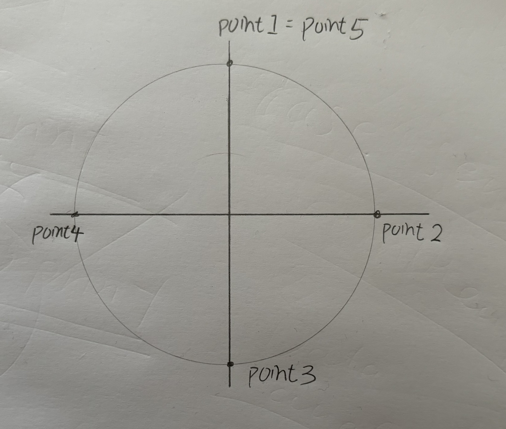

# Members
* Kai-Ze, Deng
* Yang, Wu
* Andrei, Cristea 
* Omar, Ashour

# Strategy - Using Circle Movement Function
1. To create a 360-degree circle, we need to draw two half circles, with each half circle defined by three waypoints (since three points can determine an arbitrary circle).

2. After the touch point (point 1.), define a wait time because when the marker touches the whiteboard, the whiteboard vibrates, causing variations in the depth.

3. For the first half circle, 
* Starting point: point 1.
* Viapoint: point 2.
* Endpoint: point 3.

4. For the second half circle,
* Starting point: point 3.
* Viapoint: point 4.
* Endpoint: point 5. (exactly the same as point 1.)

# Steps
1. Define the entry point
2. Define the approach point
3. Select Movement P, waypoint: point 1.
4. Select wait, time: 0.3s
5. Select Circlemovement, select unconstrained.
6. Define the viapoint: point 2.
7. Define the endpoint: point 3.
8. Define another Circlemovment, select unconstrained. (the start point is point 3.)(The two Circlemovements should be under the same branch (Movement P))
9. Define the viapoint: point 4.
10. Define the endpoint: point 5. (=point 1.)
Done.
